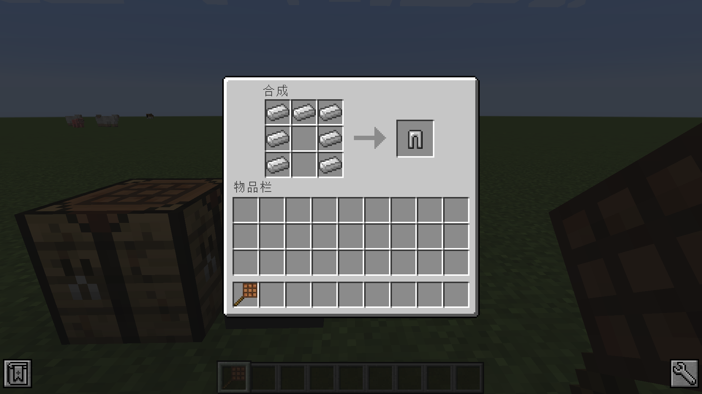

# restrictedTweaker

https://www.mcbbs.net/thread-1323001-1-1.html

# 1. 模组简介

这个模组可以为MC添加合成限制，通过魔改的方式，让合成的物品只能从特定的合成页面取出，让各种合成台都发挥出其重要性而非完全被其他合成台所取代。

# 2. 使用方法

使用方法和CrT的添加配方类似，不过增加了 classname 作为参数，classname 可以有无数个，代表允许合成的classname。

``` java
//引入模组
import restrictedtweaker.restrictedRecipe;

val iron = <minecraft:iron_ingot>;
val leggings = <minecraft:iron_leggings>;

//移除原有配方
recipes.remove(leggings);
//添加有序合成，但限制了必须要原版工作台的页面才能合成
restrictedRecipe.addShaped("CTLeggings", leggings,
[[iron,iron,iron],
 [iron,null,iron],
 [iron,null,iron]],
["net.minecraft.inventory.ContainerWorkbench","net.minecraft.inventory.Container"]);
```

这下就可以使用原版工作台来合成


但不可以使用其他合成台来完成


由于判断方式来自于 classname，因此会被某些模组所逃课。



# 3. 文档参考

``` java
restrictedRecipe.addShaped(output, ingredients, classname, function, action);
restrictedRecipe.addShaped(name, output, ingredients, classname, function, action);

restrictedRecipe.addShapedMirrored(output, ingredients, classname, function, action);
restrictedRecipe.addShapedMirrored(name, output, ingredients, classname, function, action);

restrictedRecipe.addShapeless(output, ingredients, classname, function, action);
restrictedRecipe.addShapeless(name, output, ingredients, classname, function, action);

restrictedRecipe.addHiddenShaped(name, output, ingredients, classname, function, action, mirrored);
restrictedRecipe.addHiddenShapeless(name, output, ingredients, classname, function, action);
```

# 4. 调试模式

可以在模组设置里开启调试模式


这里分别有两行输出
Alpha的那条是合成界面的 classname，打开合成界面显示。
Beta的那条是合成所需额外的 classname，一般在正确摆放配方后但无法合成才显示。


``` java
//也就是说将classname设置为以下内容，便是设置为只能通过合成终端合成物品。
["appeng.container.implementations.ContainerCraftingTerm",
"appeng.container.slot.SlotCraftingTerm"]
```