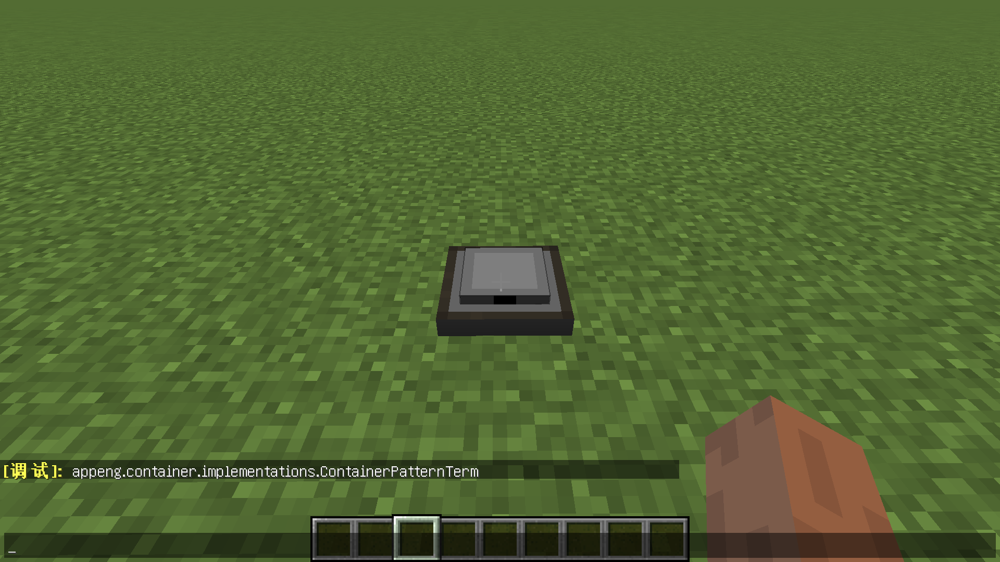

# restrictedTweaker

https://www.mcbbs.net/thread-1323001-1-1.html

# 1. 模组简介

这个模组可以为MC添加合成限制，通过魔改的方式，让合成的物品只能从特定的合成页面取出，让各种合成台都发挥出其重要性而非完全被其他合成台所取代。

# 2. 使用方法

### CraftTweaker

使用方法和 CraftTweaker 的添加配方类似，不过增加了 classname 作为参数，classname 可以有无数个，代表允许合成的classname。

``` javascript
//引入模组
import restrictedtweaker.restrictedRecipe;

val iron = <minecraft:iron_ingot>;
val leggings = <minecraft:iron_leggings>;

//移除原有配方
recipes.remove(leggings);
//添加有序合成，但限制了必须要原版工作台的页面才能合成
restrictedRecipe.addShaped("CTLeggings", leggings,
[[iron, iron, iron],
 [iron, null, iron],
 [iron, null, iron]],
["net.minecraft.inventory.ContainerWorkbench"]);
```

这下就可以使用原版工作台来合成


但不可以使用其他合成台来完成


API 参考:

``` javascript
restrictedRecipe.addShaped(output, ingredients, classname, function, action);
restrictedRecipe.addShaped(name, output, ingredients, classname, function, action);

restrictedRecipe.addShapedMirrored(output, ingredients, classname, function, action);
restrictedRecipe.addShapedMirrored(name, output, ingredients, classname, function, action);

restrictedRecipe.addShapeless(output, ingredients, classname, function, action);
restrictedRecipe.addShapeless(name, output, ingredients, classname, function, action);

restrictedRecipe.addHiddenShaped(name, output, ingredients, classname, function, action, mirrored);
restrictedRecipe.addHiddenShapeless(name, output, ingredients, classname, function, action);
```

### KubeJS

使用方法和 KubeJS 的添加配方类似，不过增加了 classname 作为参数，classname 可以有无数个，代表允许合成的classname。

``` javascript
//移除原有配方
events.listen('recipes.crafting_table', function (event) {
  event.remove('minecraft:stone')
})

//添加有序合成，但限制了必须要原版工作台的页面才能合成
events.listen('restrictedtweaker.crafting_table', function (event) {
  event.addShaped('minecraft:stone', [
    'SAS',
    'S S',
    'SAS'
  ], {
    S: 'minecraft:sponge',
    A: 'minecraft:apple'
  }, ["net.minecraft.inventory.ContainerWorkbench"])
})
```

API 参考:

``` javascript
event.addShaped(recipeID, output, pattern, ingredients, classname);
event.addShaped(output, pattern, ingredients, classname);

event.addShapeless(recipeID, output, ingredients, classname);
event.addShapeless(output, ingredients, classname);

event.add(recipeID, recipe, classname);
```

# 3. 调试模式

如果不知道合成界面的 classname，可以在模组设置里开启调试模式。


然后添加空 classname 的配方，以 KubeJS 为例：

``` javascript
events.listen('restrictedtweaker.crafting_table', function (event) {
  event.addShaped('minecraft:stone', [
    'SAS',
    'S S',
    'SAS'
  ], {
    S: 'minecraft:sponge',
    A: 'minecraft:apple'
  }, [])
})
```

摆放合成会后出现该合成台所需求的 classname，填上后再重启，重复步骤，因为某些合成台可能会有多个 classname。



最后，只能通过样板终端制作样板并自动合成的 classname 如下：

``` javascript
//也就是说将classname设置为以下内容，便是设置为只能通过自动合成来物品。
["appeng.container.implementations.ContainerPatternTerm",
 "appeng.helpers.PatternHelper"]
```